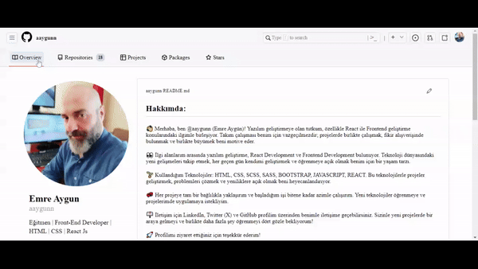

<h1> Git Hub Web Page Clone </h1>

Projemde HTML, CSS ve SCSS kullanarak sayfa yapısını oluşturup, GitHub'un özgün tasarımını yakalamaya çalıştım.

SCSS'in CSS yazımını daha düzenli ve okunabilir hale getirme yeteneği, style özelliğini daha yönetilebilir hale getirmesi sebepleriyle tercih ederek uyguladım. 

Demo için  tıklayabilirsiniz.

<h2>Kullanılan Teknolojiler</h2>

<li>HTML</li>
<li>CSS</li>
<li>SCSS</li>

<h2>Ekran Görüntüsü</h2>

